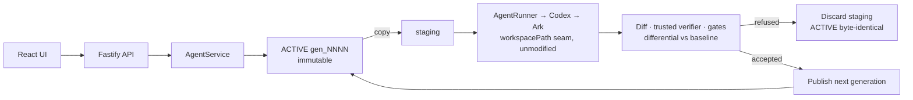

# StateGuard

StateGuard is agent middleware for TikTok TechJam Track 1. It evaluates what a
changed Agent actually does to persistent state, not what its instructions say:
every production Run is transactional, and a release change must earn
same-state behavioral evidence before promotion.

It is built on the Volc Agent Launchpad starter. The two guarantees are:

1. A failed, cancelled, blocked, or empty Run cannot corrupt the durable
   workspace; only a verified diff can become a new immutable generation.
2. A changed Agent cannot reach production without a certified baseline-versus-
   candidate comparison that is still valid for the current generation and
   policy.

Run it locally with Docker, Colima, or rootless Podman, or deploy it to
Volcengine ECS.

> [!WARNING]
> This is a single-user hackathon proof of concept. Do not use production data
> or credentials. See [SECURITY.md](SECURITY.md).

## Screenshots

### Agent Playground


### Create an Agent


## Features

- StateGuard transactional generations and release certification
- Absolute policy gates plus an independent trusted verifier
- Differential detection of new destructive behavior
- Compare-and-swap promotion with generation and policy staleness checks
- React and TypeScript Web UI
- Agent create, edit, start, stop, delete, and multi-turn chat
- Fastify control plane with asynchronous Run state
- Persistent Agent workspaces and Codex sessions
- Disposable Docker, Colima, or Podman container for each local turn
- Docker and Terraform deployment paths for Volcengine ECS

## Requirements

- Node.js 22+
- npm 10+
- Docker, Colima, or Podman
- A Volcengine Ark API key and endpoint that supports the Responses API

Codex CLI is included in the Runtime image and is not required on the host.

## Local browser SOP

### 1. Check the local tools

Install Node.js 22+ and one supported container engine, then verify them:

```bash
node --version
npm --version
docker --version        # Docker Desktop, Docker Engine, or Colima
podman --version        # Use this instead when running Podman
```

Only one container engine is required. Codex CLI is already included in the
Runtime image.

### 2. Clone the repository

```bash
git clone <repository-url> volc-agent-launchpad
cd volc-agent-launchpad
```

Skip this step when already working from the repository root.

### 3. Start the POC

```bash
ARK_API_KEY=your-ark-api-key \
ARK_MODEL=ep-your-endpoint-id \
bash run-local.sh
```

The first run installs Node.js dependencies and builds the Runtime image. The
script automatically selects Docker, Colima, or Podman. On Windows,
`run-local.sh` replaces `npm run poc` because the starter's POSIX startup
script cannot be launched through the Windows npm shell. Run npm commands from
PowerShell, not Git Bash.

### 4. Open the browser

Visit <http://localhost:3000>, or open it from the terminal:

```bash
open http://localhost:3000       # macOS
xdg-open http://localhost:3000   # Linux desktop
```

In the Web UI:

1. Select **Create Agent**.
2. Enter a name, description, and workspace instructions.
3. Select **Create Agent** again.
4. Enter a task in the Playground, for example:

   ```text
   Create a TypeScript hello-world CLI, add a test, and run it.
   ```

The Agent can write files, run commands, and continue the same Codex session in
later messages.

### 5. Stop and resume

Press `Ctrl+C` in the startup terminal. The script removes temporary Runtime
containers but keeps Agent workspaces and conversations.

- macOS state: `~/.volc-agent-launchpad/`
- Linux state: `.local/`
- Custom location: set `LOCAL_POC_DATA_ROOT`

Run the same `npm run poc` command to continue later.

### Select a specific container engine

Force Podman when multiple engines are installed:

```bash
CONTAINER_ENGINE=podman \
ARK_API_KEY=your-ark-api-key \
ARK_MODEL=ep-your-endpoint-id \
npm run poc
```

Colima uses `CONTAINER_ENGINE=docker` because it exposes the Docker CLI.

For a clean Linux host, follow the
[rootless Podman setup](docs/LOCAL_POC.md#rootless-podman-on-linux).

## Docker Compose

Create and edit the configuration:

```bash
./scripts/bootstrap-local.sh
```

Required values in `.env`:

```dotenv
ARK_API_KEY=your-ark-api-key
ARK_MODEL=ep-your-endpoint-id
APP_AUTH_TOKEN=replace-with-at-least-24-random-characters
```

Start the application:

```bash
docker compose up --build
```

Open <http://localhost:3000>. Stop it without deleting Agent data:

```bash
docker compose down
```

## Development

```bash
npm install
cp .env.example .env
npm install --global @openai/codex@0.111.0
npm run dev
```

- Web UI: <http://localhost:5173>
- API: <http://localhost:3000>

Use local paths in `.env` when running outside Docker:

```dotenv
APP_DATA_DIR=.data
AGENT_WORKSPACE_ROOT=workspaces
CODEX_HOME=codex-home
```

## Deployment

- [Existing Linux ECS with Docker](docs/DEPLOYMENT.md#existing-linux-ecs)
- [Complete Volcengine environment with Terraform](docs/DEPLOYMENT.md#terraform-deployment)
- [Local Docker, Colima, and Podman details](docs/LOCAL_POC.md)

The existing-ECS script deploys from the current source tree:

```bash
cp .env.example .env.production
./scripts/deploy-existing-ecs.sh .env.production
```

The Terraform path provisions VPC, subnet, security group, ECS, and EIP:

```bash
cp deploy/volcengine/terraform.tfvars.example \
  deploy/volcengine/terraform.tfvars
./scripts/deploy-volcengine.sh
```

## Configuration

| Variable | Default | Purpose |
| --- | --- | --- |
| `ARK_API_KEY` | Required | Ark model API key. |
| `ARK_MODEL` | Required | Responses-capable endpoint or model ID. |
| `ARK_BASE_URL` | Beijing v3 endpoint | Ark OpenAI-compatible API URL. |
| `APP_AUTH_TOKEN` | Empty on loopback | Shared demo token; use 24+ random characters remotely. |
| `RUNTIME_PROVIDER` | `local-process` | `container` for disposable local Runtime containers. |
| `CODEX_SANDBOX_MODE` | `workspace-write` | Codex inner sandbox mode. |
| `CODEX_TIMEOUT_MS` | `600000` | Maximum duration of one turn. |
| `LOCAL_POC_DATA_ROOT` | Platform-specific | Local metadata, workspace, and session directory. |

See [.env.example](.env.example) for all Runtime and resource-limit options.

## How it works

**The Agent never edits current state. It proposes the next state.**



Two diagrams in [docs/ARCHITECTURE.md](docs/ARCHITECTURE.md) break this down: the
per-Run execution path, and the release-control path where a candidate is judged
against the active release from the same world state.

The integration seam is the starter's `AgentRunner.run({ agentId,
workspacePath, prompt, threadId })`. StateGuard changes the
`workspacePath` it passes: production Runs receive a staging directory, while
the runner implementation remains unchanged. A successful non-empty Run
renames staging into the next immutable generation and then advances the
ACTIVE pointer. Validation runs baseline and candidate sequentially against
the same generation, with fresh ephemeral threads; both staging trees are
always discarded. Promotion changes only the active release, never the active
generation.

The first production turn uses `codex exec`; later turns resume the stored
Codex thread. Validation never uses that production thread. Deleting an Agent
archives its workspace under `workspaces/.deleted/`.

## Guarantees and limits

### Behavioural history is evidence, not a corpus

Each production Run that publishes a non-empty generation appends its manifest effects
to a per-Agent JSONL sidecar. StateGuard uses that longitudinal evidence to flag a
candidate deletion under a directory the Agent has never previously deleted from.
This is complementary to the same-task differential: history spans tasks; the
baseline comparison holds task and world state fixed. Below five published Runs the
signal remains informational only — a cold-start Agent has no meaningful envelope yet.
Novel effects require an audited review only after that threshold; they are never
absolute gate failures. The system records regression evidence from observed Runs; it
does not claim that an instruction caused an effect.

### Diagnose observed drift

An operator can binary-search changed instruction paragraphs with discarded,
fresh-thread probes. The resulting minimal subset is attribution evidence, not proof of
causation; StateGuard marks it inconclusive when the observed deletion does not recur.

### Shared worlds

Agents can share one immutable generation lineage. StateGuard provides snapshot
isolation with first-committer-wins: disjoint concurrent changes are rebased, while
overlapping paths are refused before the second write becomes durable.

Generations contain pure world state. `AGENTS.md` is platform-managed,
synthesized into staging only, hashed, and stripped before diffing. The trusted
verifier is outside Agent control and reads its command from server-side policy.

**Absolute gates and behavioural drift are separate outcomes, and only one is
reviewable.** An absolute gate — protected path, verification, change budget,
instruction tampering, runtime failure — encodes something forbidden outright, so
it produces `BLOCKED`, which cannot be acknowledged or promoted by anyone. A new
destructive effect absent from the baseline is *not* forbidden; that is the entire
point of the differential. It produces `REVIEW_REQUIRED`, which a human can promote
only with a recorded actor and reason. Collapsing the two would make every hard
invariant overridable by anyone willing to type a justification.

**The verifier mounts the workspace read-only.** It runs after the authoritative
diff is computed and before the generation is published, so a writable mount would
let a test or build command deposit files that get committed without ever appearing
in the diff or counting against the change budget. The verifier observes the subject
under test; it cannot alter it. A verification command that needs to write is
therefore out of scope by design.

The generation commit is **crash-safe, NOT ATOMIC**: `rename(staging ->
gen_NNNN)` and the ACTIVE-pointer update are two operations. A crash between
them can leave a harmless orphaned generation, never a missing or corrupted
active generation. Separately, the persistent workspace is the transaction
boundary; it excludes external side effects such as network writes, email,
and payments.

Known limitations are intentional and visible to the judge:

- **Behavioural history is a signal, never a gate.** A candidate deletion under a
  directory prefix this Agent has never deleted under is surfaced as `NOVEL_EFFECT`.
  It never appears in `candidateGateFailures`; it contributes to `REVIEW_REQUIRED`,
  which a human can still promote with a recorded actor and reason. Below
  `HISTORY_MIN_RECORDS` (5 by default) the envelope is too thin to mean anything, so
  the signal is **informational only** and does not affect the outcome. The
  architecture for a compounding corpus is shipped; a corpus with real depth needs
  production history this project has not accumulated. Do not claim otherwise.
- **Bisection produces attribution evidence, not causation.** It binary-searches
  changed instruction segments and reports the minimal subset that reproduced an
  effect. Each probe is one execution of stochastic software, so a segment that fails
  to reproduce is not proven innocent. When the full candidate set fails to reproduce
  the target, the result is explicitly marked `inconclusive`.
- **Concurrency guarantee: snapshot isolation, first-committer-wins.** Agents sharing
  a world stage from a base generation; on commit, work disjoint from generations
  committed since that base is rebased and published, and overlapping work is refused
  as `CONCURRENT_WRITE_CONFLICT`. This is path-level, not semantic — two Agents
  editing different regions of the same file conflict, and two Agents making
  semantically incompatible edits to different files do not.
- Symlinks and empty directories are not tracked by the diff engine.
- Full-tree copying retains each generation; garbage collection is not yet
  implemented.
- One execution of stochastic software is regression evidence, not proof of
  causation. The system reports what we observed in that execution.
- **Ghost Replay is presentation, never evidence.** Its event journal is
  explicitly non-authoritative: the manifest diff is what every gate decision is
  made from. The journal also deliberately withholds file contents for
  credential-shaped paths (`.env`, `*.key`, `*.pem`, `*secret*`, and similar),
  for files over 64 KB, and once a 512 KB per-journal budget is spent, recording
  the reason on the event. Withheld events still replay structurally. Contents
  are withheld because the journal is persisted into the metadata store and
  served to the browser, and neither may carry unredacted secrets.
- **Canary rollout is opt-in and off by default.** It is the only feature that
  touches the live Run path, so it is gated behind `CANARY_ENABLED`, which
  accepts only affirmative values (`true`, `1`, `yes`, `on`, case-insensitive).
  Anything else, including an unrecognised value, fails safe to off — the switch
  exists so the canary can be taken off the live path in a hurry, which only
  works if the obvious value actually disables it.

Use this language precisely:

| Say | Do not say |
| --- | --- |
| crash-safe | atomic |
| tamper-evident | tamper-proof |
| regression evidence | proof of causation |
| the persistent workspace is the transaction boundary | we roll back everything the agent did |
| we observed this behavior in this execution | the candidate always does this |

See [docs/ARCHITECTURE.md](docs/ARCHITECTURE.md) for component and extension
boundaries.

## Validation

```bash
npm run check
terraform fmt -check -recursive deploy/volcengine
docker compose config
```

The final MVP was tagged `mvp-complete`. The deterministic test suite is run
serially on the Windows/Docker development host:

```powershell
npx vitest run --pool=forks --maxWorkers=1
```

See [the Devpost draft](docs/DEVPOST.md) and [the three-minute demo script](docs/DEMO-SCRIPT.md)
for the submission copy and recording plan.

## Documentation

- [Architecture](docs/ARCHITECTURE.md)
- [Local POC](docs/LOCAL_POC.md)
- [Deployment](docs/DEPLOYMENT.md)
- [Hackathon extension guide](docs/HACKATHON_EXTENSION_GUIDE.md)
- [Security policy](SECURITY.md)
- [Contributing](CONTRIBUTING.md)

## License

[MIT](LICENSE)
