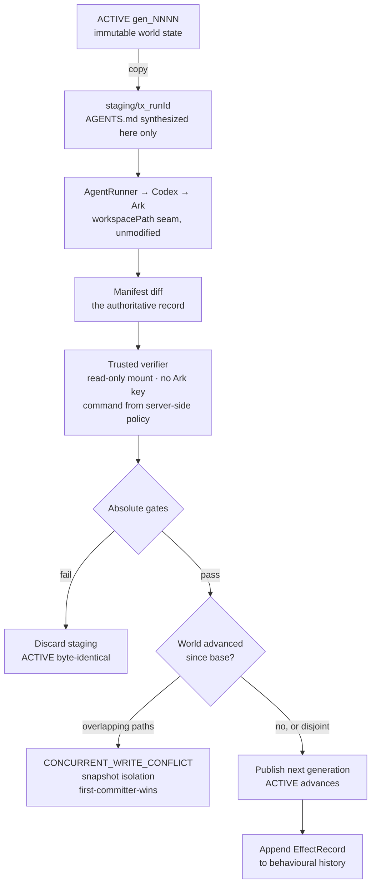
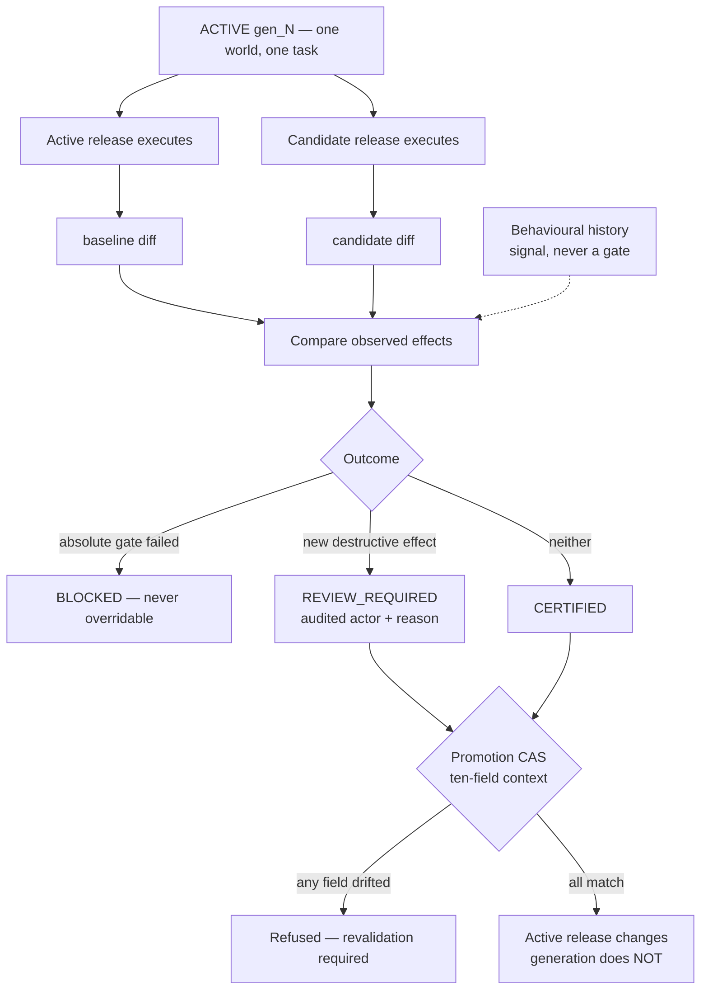

# Architecture

StateGuard is middleware inserted at the starter's own execution seam. The starter
mounts an Agent's persistent workspace directly into Codex, so a failed Run leaves
partial mutations behind and a behaviour change reaches production untested.
StateGuard changes what the platform hands to the Runner, and adds a release
control plane around it.

**The Agent never edits current state. It proposes the next state.**

## The seam

`AgentRunner.run({ agentId, workspacePath, prompt, threadId })` takes a
caller-provided path. StateGuard changes only what that path points at — a staging
copy instead of the live workspace. The starter's runners are unmodified and
unforked, and both the container and local-process providers work unchanged.

**Every Run — the Agent proposes the next state, never edits the current one:**



**Release control — the same machinery, pointed at a behaviour change:**



## Execution model

Every Run — production or validation — follows the same path:

1. **Stage.** Copy the active generation to `staging/tx_<runId>`. Synthesize
   `AGENTS.md` from the executing release into staging only.
2. **Execute.** The Runner receives the staging path. It cannot reach the active
   generation.
3. **Observe.** Re-hash `AGENTS.md` (tamper detection), strip it, then compute the
   manifest diff against the base generation. The diff is the authoritative record of
   what happened.
4. **Verify.** An independent container runs the policy's command with the workspace
   mounted **read-only**, no `ARK_API_KEY`, and no `codex-home`. It runs after the
   diff and before publication, so a writable mount would let it deposit files that
   get committed without appearing in the diff.
5. **Gate.** Deterministic absolute gates evaluate the diff.
6. **Publish or discard.** Passing production Runs are renamed into the next
   generation and the ACTIVE pointer moves. Everything else is discarded, leaving the
   active generation byte-identical. Validation staging is *always* discarded.

## Release control

Releases version `name + description + instructions` together, because all three
feed `AGENTS.md`. Editing an Agent mints a candidate; it never patches in place.

**Policy is a separate axis from the release.** A release is what the Agent is
*told*; policy is what the platform *enforces*. Tightening a guardrail therefore
invalidates existing certifications rather than minting a candidate that needs
approval — folding policy into the release would mean re-running the Agent to
approve your own safety tightening.

### Validation

The active release and the candidate execute **sequentially, against the same base
generation, task, policy and runtime**, each with a fresh ephemeral Codex thread.
Neither touches production's thread. Their observed effects are compared.

| Outcome | Meaning | Promotable |
| --- | --- | --- |
| `CERTIFIED` | No absolute failure, no new destructive effect | Yes |
| `REVIEW_REQUIRED` | A deletion the baseline did not make. Not forbidden — new | Yes, with a recorded actor and reason |
| `BLOCKED` | An absolute gate failed | **Never** |
| `BASELINE_UNHEALTHY` | The active release failed its own gates; the candidate was not judged | No |

Absolute gates encode things that are forbidden outright, so they are terminal.
Behavioural drift is *not* forbidden — that is the entire point of comparing against
a baseline — so it escalates to a human instead of refusing.

### State-bound promotion

A certification is bound to a ten-field `ValidationContext`:

```text
baselineReleaseHash   candidateReleaseHash
generationId          generationHash        <- content, not just the label
taskHash              policyHash
arkModel              codexVersion
sandboxMode           runtimeImage          <- enforcement context
```

Promotion recomputes all ten and refuses unless every field still matches, naming
which one drifted and its before/after values. `generationHash` matters because the
id is only a label: editing a file inside `generations/gen_0012` leaves it called
`gen_0012`, and evidence bound to the label alone would survive exactly the state
change it exists to detect.

This is optimistic concurrency control applied to release authority: *read v12, do
work, commit only if it is still v12* becomes *certify against gen_12, promote only
if production is still gen_12*.

## Shared worlds

Worlds own the active immutable generation; Agents carry a `worldId`. A Run stages
from its base generation and commits with **snapshot isolation, first-committer-wins**.
If the world advanced, StateGuard compares changed paths since the base: disjoint work
is rebased and published sequentially, while overlap is refused as
`CONCURRENT_WRITE_CONFLICT`, naming the path and winning generation. Solo Agents keep
their private world and fast-path behavior unchanged.

This is the failure no single diff can reveal. Agent A refactors a config key; Agent B
adds an option to that config. Both diffs are clean, both pass every gate, and the
damage lives in the interaction — invisible in either review. Git detects such
conflicts textually and hands them to a human; this detects them before either write
becomes durable, automatically, under a stated isolation level.

## Behavioural history

After a production Run has passed its absolute gates and published a non-empty
generation, StateGuard appends an `EffectRecord` to
`<dataDirectory>/history/<agentId>.jsonl`. The control-plane `JsonStore` intentionally
does not carry this growing evidence data. A cached in-memory envelope counts deleted
directory prefixes, modified prefixes, and exact touched paths. A candidate deletion
under a prefix never before deleted by that Agent is surfaced as `NOVEL_EFFECT`.

`NOVEL_EFFECT` is behavioural regression evidence, not an absolute policy gate. It
never appears in `candidateGateFailures`. Until `HISTORY_MIN_RECORDS` (five by default)
published records exist, it is explicitly informational; after that, it contributes to
`REVIEW_REQUIRED` and requires the existing audited acknowledgement path.

## Behavioural bisection

An operator can diagnose an observed deletion with a binary search over changed
instruction paragraphs (or lines when no paragraphs exist). Each probe is an
in-memory `probe` release, runs in discarded staging with a fresh thread, and is never
stored, listed, or promotable. Its result is attribution evidence, not causation; an
effect that does not reproduce is explicitly marked `inconclusive`.

## Concurrency

`JsonStore` serializes mutations through a promise queue. Every decision that depends
on Agent status — send, edit, policy change, validate, promote — is **re-checked inside
the serialized mutation**, not only in a read-only pre-flight, because a snapshot read
lets two callers both observe `ready`.

Generation publication is additionally serialized **per world**, so the conflict check
and the commit that follows it cannot interleave with another Agent's commit to the
same world.

## Guarantees and limits

The generation commit is **crash-safe, not atomic**: the rename and the ACTIVE
pointer update are two operations, so a crash between them leaves a harmless
orphaned generation, never a missing or corrupted one. The persistent workspace is
the transaction boundary; external side effects are outside it. See the README for
the full limitations list and the language table.
