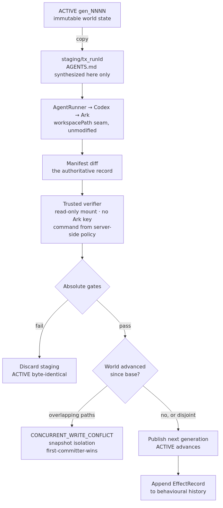
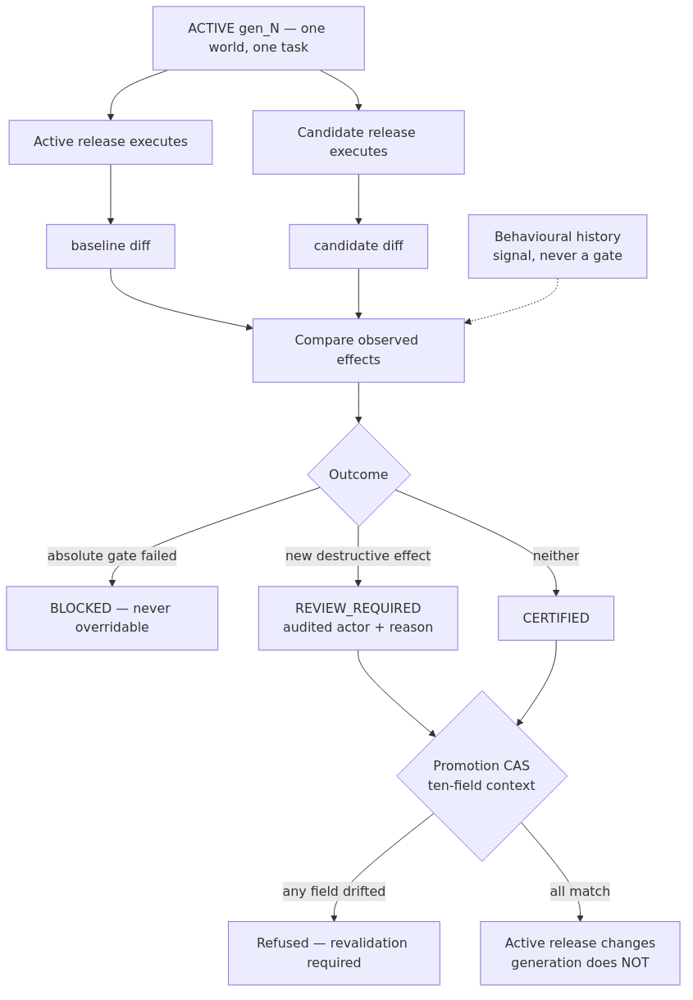

# StateGuard — Devpost submission draft

## One-line pitch

StateGuard makes agent behavior releasable: it runs a known-good Agent and a
candidate against the same workspace state, blocks new destructive effects,
and refuses to promote evidence that has gone stale.

## What we built

Coding Agents can be useful and dangerous at the same time. A normal test
suite can pass while an Agent deletes an unprotected but important file, and a
prompt can ask an Agent to be careful without enforcing it. StateGuard adds a
backend middleware boundary around the starter platform.

Every production Run executes in a staging copy. A diff and an independent
trusted verifier decide whether it can become the next immutable workspace
generation. Agent identity and policy are separate from the release. Before a
new release is promoted, StateGuard runs the active release and candidate
sequentially against the same generation, task, policy, and runtime. The
candidate is blocked if it deletes a path the baseline did not delete. A
successful certification is bound to a ten-field context fingerprint;
promotion is refused if the generation (by content, not just its label), policy, release, task,
model, Codex version, sandbox mode, or runtime image has drifted.

## Why the baseline comparison matters

The absolute gates intentionally allow many ordinary paths. The flagship case
is an unprotected `docs/legacy-notes.md` deletion: verification passes, the
change budget passes, and no protected path is touched. The baseline makes the
new destructive behavior visible anyway. In the recorded run, the baseline
added `NOTES.md`, the candidate deleted `docs/legacy-notes.md`, both absolute
gate lists were empty, and the differential gate returned that deletion.

## Beyond the core guarantee

Built on the same primitives, each independently tested:

- **Instruction tamper detection.** `AGENTS.md` is hashed before and after every
  execution. An Agent that deletes or rewrites the instructions it is judged
  against fails an absolute gate — without this, every other gate is advisory.
- **Trusted verification.** The verifier runs in its own container with no Ark
  credential and no `codex-home` mount, and takes its command from server-side
  policy, never the workspace. An Agent that rewrites `package.json` cannot fake
  a pass.
- **Tamper-evident ledger.** Every validation, promotion and refusal is an
  append-only HMAC-signed record carrying the previous entry's hash. The signing
  key is persisted, so restarts do not invalidate legitimate history.
  Tamper-evident under the server-key trust assumption — not tamper-proof.
- **Audited human override, correctly scoped.** Behavioural drift escalates to
  REVIEW_REQUIRED and is promotable only with a recorded actor and reason. An
  absolute gate failure is BLOCKED and can never be acknowledged or overridden —
  collapsing the two would make every hard invariant negotiable.
- **Fork from a generation.** Any generation can be forked into an independent
  Agent with a fresh session — recovery, not just refusal.
- **Canary rollout with auto-rollback**, opt-in and off by default.
- **Ghost Replay**, a non-authoritative visualisation of what a candidate would
  have done, with credential-shaped and oversized file contents withheld.
- **Behavioural history.** Each published production generation contributes an
  append-only effect record. A deletion under a never-before-deleted directory
  is surfaced as a novel effect only after five historical Runs; before that it
  is explicitly informational. This compounds regression evidence over time —
  it is not a claim that the initial history is representative.

## Technical stack

Behavioural bisection is also available on demand: it runs discarded ephemeral probes
to isolate a minimal reproducing instruction subset. The result is honestly labelled
attribution evidence and becomes inconclusive when the observed effect does not recur.

- TypeScript, Fastify, React, Vite, Vitest
- Volcengine Ark Responses API through Codex CLI
- Docker Desktop runtime with a local-process-compatible runner seam
- JSON metadata store with serialized mutations and atomic file replacement

## Architecture and repository



*Every Run: the Agent stages a copy of the immutable ACTIVE generation, and only a
diff that passes the trusted verifier and the absolute gates is published as the next
generation. A failed, refused, or crashed Run leaves the ACTIVE generation
byte-identical.*



*Release control: the active release and the candidate execute against the same world
state and task, their observed effects are compared, and the resulting certification is
bound to a ten-field context that expires the moment any of it drifts.*

The architecture diagram and local instructions are in the repository
[README](../README.md). The implementation changes only the caller-provided
`workspacePath` at the existing `AgentRunner` seam; the starter runner is not
forked. The public repository URL should be added here before submission.

The repository also contains [docs/ARCHITECTURE.md](ARCHITECTURE.md), which
describes the execution model, the release control plane, and the ten-field
validation context.

## Honest limitations

The persistent workspace is the transaction boundary, not external systems.
The generation publication is crash-safe, not atomic, and an orphaned
generation can remain after a crash. Symlinks and empty directories are not
tracked. A single stochastic execution is regression evidence, not proof of
causation. See the full limitations and language table in the README.

## Testing instructions

On Windows, use PowerShell for npm and start the POC with `bash run-local.sh`.
Use `RUNTIME_PROVIDER=local-process` for development when a container engine is
unavailable; the StateGuard design is provider-agnostic because it changes
only the workspace path passed to the runner.

```powershell
npm install
npm run check   # typecheck, 70 tests, then both builds
```

Test files run serially by configuration (`apps/server/vitest.config.ts`). The
suite mixes container integration tests, whole-tree copy-and-hash work, and
async flows polled against wall-clock deadlines; in parallel on a loaded host
those fail intermittently and in a different place each run. Serial takes about
a minute and is deterministic, which is what a verification suite is for.

## Team / track

TikTok TechJam 2026 — Track 1, Agent Middleware.

## Before submitting — fill these in

- [ ] Public repository URL (replace the placeholder in "Architecture and repository")
- [ ] Public YouTube demo video URL, ~3 minutes, tested in an incognito window
- [ ] Team member names, with every member registered on **both** Devpost and the
      registration form — only those registered on both are eligible
- [ ] Submitted on Devpost before **1 September 2026, 12:00**
